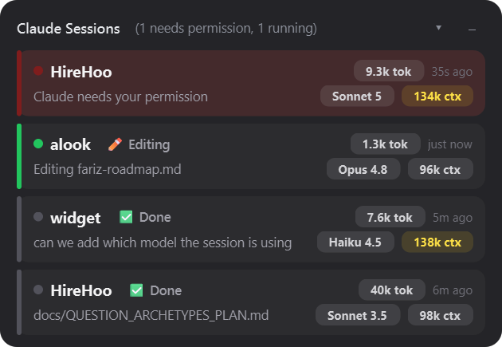

# Claude Sessions Widget

**Windows only** — the click-to-focus and autostart features are built on
Win32 APIs (`winreg`, `AttachThreadInput`/`SetForegroundWindow` via
`focus_session.ps1`) with no cross-platform equivalent implemented.

> Unofficial, community-built tool. Not affiliated with, endorsed by, or
> supported by Anthropic. "Claude" and "Claude Code" are Anthropic's
> trademarks, used here only to describe compatibility.

An always-on-top desktop widget that shows, live, every Claude Code CLI session
running on this machine: project (folder name), current task, and whether it's
running, idle, finished, possibly closed, or waiting on your permission. The
window height grows and shrinks automatically with the number of sessions.



*(Rendered from synthetic demo data for illustration — not a real session.)*

## How it works

1. Seven hooks are wired into the **global** `~/.claude/settings.json`
   (`SessionStart`, `UserPromptSubmit`, `PreToolUse`, `Notification`,
   `PostToolUse`, `Stop`, `SessionEnd`). Each one calls
   `hooks/widget_status.py <event>` with the Claude Code hook JSON on stdin.
2. That script writes one JSON file per session to `~/.claude/widget-status/`:
   - `SessionStart` → creates the file, `status: "idle"`, and sniffs
     `languageIcon` once from top-level marker files in the project
     directory (`pyproject.toml`/`requirements.txt`/`setup.py`/any `*.py`
     → 🐍, `package.json` → 📦, `Cargo.toml` → 🦀, `go.mod` → 🐹). Cached on
     first write and never recomputed, so it can't flicker mid-session —
     see `detect_language_icon()`. Recorded in the status file but not
     currently rendered in the UI (the project name is shown plain); kept
     around for tooling/future use.
   - `UserPromptSubmit` → `status: "running"`, `task` = the prompt text, and
     clears any leftover tool line from the previous turn.
   - `PreToolUse` (a tool is about to run) → `currentTool` = the tool name,
     `currentToolDetail` = a one-line human description derived from
     `tool_input` (e.g. `Read` on `README.md` → "Reading README.md", `Bash`
     with `pytest tests/` → "Running pytest tests/"). Unrecognized tools
     (custom/MCP tools) fall back to "Using \<ToolName\>" rather than showing
     nothing. This line takes priority over the plain task text in the row
     while it's set, so you can see what Claude is actually doing turn by
     turn — see `describe_tool_use()`. The same `currentTool` value also
     drives a short "personality" tag next to the project name (e.g. "✏️
     Editing", "🧠 Thinking" while no tool is active yet this turn, "✅
     Done" once finished, "💤 Idle" before the first prompt) — computed
     purely in the UI from data already in the status file, see
     `_personality_text()` in `ui/session_row.py`. It's suppressed for the
     `permission` and `stale` states, which already have their own
     dedicated visual treatment.
   - `Notification` → if the message mentions "permission" (Claude Code sends
     this whenever it needs you to approve a tool call), `status: "permission"`
     and `alert` = the notification text. Idle-input nudges (the other kind of
     Notification event) are ignored on purpose — this is only for permission
     prompts.
   - `PostToolUse` (a tool actually ran) → clears a `permission` state back
     to `running` (proof the prompt was approved). It only touches records
     currently in the permission state: Stop and PostToolUse are both async
     hooks, so an unconditional write could land after Stop and flip a
     finished session back to running.
   - `Stop` (Claude finishes responding) → `status: "finished"`, plus
     `tokens: {input, output}` for that turn (see below), and clears the
     tool line.
   - `SessionEnd` (the CLI actually exits) → deletes the file.
3. `app.py` polls that directory every 2 seconds and renders one row per file.
   - A `running` session whose file hasn't been touched in 10+ minutes is
     shown as **possibly closed** (amber) — this covers a terminal window
     being force closed without Claude Code getting a chance to run
     `SessionEnd`.
   - A session waiting on a permission prompt is sorted to the very top and
     its accent bar/status dot blink red every 500ms until it clears.
4. Files untouched for 24+ hours are pruned automatically as basic garbage
   collection for crashed/never-closed sessions.
5. **Token count per turn**: `UserPromptSubmit` records the byte offset of the
   session's transcript file (`transcript_path` from the hook payload) at the
   moment the prompt is submitted. `Stop` reads everything appended to that
   transcript since that offset and sums the `usage.input_tokens` /
   `usage.output_tokens` fields across every assistant message in that turn.
   Usage is deduplicated by message id, because one API message can span
   several transcript lines (e.g. separate entries for its thinking block
   and its tool_use block) that each repeat the same usage object — summing
   per line would roughly double the count. If no offset was ever recorded
   (a resumed session where `UserPromptSubmit` never fired), the token field
   is skipped rather than summing the entire transcript as one turn.
   This is the fresh input+output count — it deliberately excludes
   `cache_read_input_tokens`/`cache_creation_input_tokens`, which are often
   100x larger than the real per-turn cost due to prompt caching and would
   dominate the display. The full breakdown is available in the row's tooltip
   if you hover it; only the input+output total is shown inline (e.g. "30k
   tok"). If no transcript path is available, the token badge is just omitted
   for that row — this never blocks or errors.
6. **Token pill colors**: both token pills (per-turn and context, see below)
   tint using the same tiers — grey by default, yellow past 100k, orange past
   150k, red past 200k (see `token_tier()` in `status_store.py`).
7. **Context size**: the per-turn token pill deliberately excludes
   `cache_read_input_tokens`/`cache_creation_input_tokens` (see above), but
   that means it can't show how large the conversation itself has gotten —
   which is what actually gets resent (and billed) on every future turn, and
   what eventually triggers auto-compaction. `Stop` also calls
   `latest_context_size()`, which reads just the tail of the transcript
   (bounded to `CONTEXT_TAIL_BYTES`, so the cost doesn't grow with session
   length) and takes `input_tokens + cache_creation_input_tokens +
   cache_read_input_tokens` from the *last* usage entry seen — i.e. the full
   size of what was actually sent to the model on the most recent API call.
   That's stored as `contextTokens` and rendered as a second pill (e.g. "82k
   ctx") next to the per-turn one, using the same `token_tier()` color
   thresholds — which is the number those thresholds actually describe well,
   since 100k–200k of *cumulative* context is a realistic and meaningful
   range, unlike 100k–200k in a single turn. The first time a session's
   `contextTokens` crosses 150k, a one-time tray notification fires
   suggesting you start a fresh session (large contexts get slower and more
   expensive); it won't repeat for that session even if the total keeps
   climbing, and it resets if the session disappears and a new one reuses
   the slot. It's deliberately keyed off context size rather than the
   per-turn total — a single huge turn (e.g. reading one large file) isn't
   the same signal as a conversation that's actually grown large — see
   `_check_token_warning()` in `ui/main_window.py`.
8. **`cd` commands are shortened** in the task line to just the target
   folder (e.g. `cd "C:/long/path/to/widget" && pytest` → `cd widget/ &&
   pytest`) — see `_shorten_cd_command()` in `hooks/widget_status.py`. Long
   absolute paths otherwise dominate the line with no useful signal.
9. **Model pill**: `Stop` also calls `latest_model()`, which reads the same
   transcript tail as `latest_context_size()` and pulls the `model` field off
   the most recent assistant message — the model actually used for the last
   API call, so a mid-session `/model` switch (or an automatic fallback)
   shows up rather than whatever the session started with. The raw id (e.g.
   `claude-sonnet-5-20250929`) is stored as-is, but `short_model_label()` in
   `status_store.py` turns it into a short label (`Sonnet 5`) for the pill —
   raw ids are too long for the row, and the version-before/after-family
   ordering has changed across model generations, so both are parsed. The
   pill sits directly left of the context pill on the task line, forming one
   right-aligned cluster under the token pill rather than spreading across
   the row; the raw id is still available in the row's tooltip. Like the
   token/context pills, it's only known once a turn completes, so a
   freshly-started session shows no model pill until its first response
   finishes.

## Setup

```powershell
cd widget
C:\Python313\python.exe -m venv .venv
.venv\Scripts\python.exe -m pip install -r requirements.txt
C:\Python313\python.exe install.py
```

`install.py` wires the 7 hooks into `~/.claude/settings.json` (backing it up
first) and is idempotent — re-run it any time you move this project folder
or switch Python installs, and it updates the existing entries in place.
Run it with the Python you want the hooks to use (the hook script is
stdlib-only; avoid the venv interpreter so the hooks don't break if the
venv is rebuilt).

## Tests

```powershell
.venv\Scripts\python.exe -m pip install -r requirements-dev.txt
.venv\Scripts\python.exe -m pytest tests/
```

Covers the hook script's token accounting (including the message-id
dedupe and resumed-session cases), process-tree walking, status
transitions, and the status store's sorting/staleness/pruning logic.
`tests/test_ui_render.py` additionally exercises the Qt layer offscreen
(no window appears): row lifecycle, task elision at different widths,
the permission blink/signal plumbing, and tray icon colors.

## Running

```powershell
.venv\Scripts\python.exe app.py
```

To launch without a console window flashing, use `pythonw.exe` instead:

```powershell
.venv\Scripts\pythonw.exe app.py
```

Only one instance runs at a time — a second launch (e.g. from a startup
shortcut while one is already running) exits immediately instead of showing
a duplicate window (`~/.claude/widget-status/_widget.lock`).

The widget starts in the top-left-ish area by default and remembers wherever
you drag it (position saved to `~/.claude/widget-status/_window.json`,
debounced). Drag anywhere on the header to move it; drag the left or right
window edge to change the width. Height is automatic — it grows and shrinks
with the number of sessions shown, capped at 80% of your screen height (it
scrolls internally beyond that).

The **▾ button** in the header collapses the window down to just the header
bar, hiding the session list — useful when you want the widget parked on
screen without it taking up room. Click **▸** to expand it again. The
collapsed state is saved to `_window.json` alongside the position and width,
so it survives a restart.

It also adds a system tray icon with a right-click menu: **Show/Hide**,
**Clear finished**, **Quit**. The icon doubles as a status light: green
normally, red while any session is waiting on a permission prompt — so
you still get the signal when the window itself is hidden to the tray.

**Click any row** to jump to that session's terminal. This is *not* done by
matching window/tab titles — an earlier version tried that and it was
unreliable, because Claude Code overwrites the tab title with its own
AI-summarized description of the current task, which doesn't reliably
contain the project name or the literal task text (and a short project name
could coincidentally substring-match a completely unrelated tab).

Instead, every hook call records `shellPid` = the pid of the actual `claude.exe`
process for that session. Naively, this could just be `os.getppid()` (the
hook's immediate parent) — but that turned out to be wrong: Claude Code
spawns hook commands through a short-lived shell wrapper that exits the
instant the hook finishes, so by the time you click a row later, that pid is
already dead. `find_stable_ancestor_pid()` walks up the real process tree
(via a `CreateToolhelp32Snapshot`, no subprocess spawn) from that ephemeral
pid to find the actual `claude.exe` ancestor, which stays alive for the
whole CLI session — that's what gets stored.

On click, `focus_session.ps1` walks up from that stable pid until it finds
an ancestor that owns a top-level window, then foregrounds it — exact, no
title-guessing. This is 100% precise when that ancestor owns exactly one
top-level window. The one remaining limitation, confirmed by testing with 2
Windows Terminal windows open side by side: if you have *multiple* Windows
Terminal windows, they're all one process, and Windows Terminal doesn't
expose which of its windows/tabs hosts which child process via UI
Automation — so in that case it foregrounds whichever of that process's
windows was **most recently in the foreground** (confirmed empirically: it's
z-order-based, not an arbitrary/fixed pick), which is a reasonable
best-effort but isn't guaranteed to be the exact right one. This is a
confirmed gap in Windows Terminal itself, not something fixable from
outside it — see [microsoft/terminal#18692](https://github.com/microsoft/terminal/issues/18692)
(open, unresolved as of this writing; the only known workaround is
`ReadProcessMemory` into WT's own memory, not something to depend on).
If nothing can be resolved at all (e.g. an old status file from before
this feature existed, with no `shellPid` recorded), clicking is just a
no-op.

Finding the right window isn't enough on its own — Windows silently denies
`SetForegroundWindow` calls from a process with no "recent input" of its
own, which is exactly what a helper process spawned just to do the
focusing (`QProcess.startDetached`) looks like from the OS's perspective.
Nothing throws in that case; the call just does nothing. `focus_session.ps1`
works around this with `AttachThreadInput` (borrowing foreground permission
from whichever thread currently owns the real foreground window for the
duration of the call), then verifies the switch actually happened
afterward instead of assuming success. Every attempt — matched, denied, or
not-found — is appended to `~/.claude/widget-status/_focus.log`, since a
denied focus call has no other visible symptom. If clicking a row ever
stops working, that log says why (a `FOCUS_DENIED` line most likely means
the terminal is running elevated/as-Administrator while the widget isn't,
since UIPI blocks focus-stealing across privilege levels no matter what;
matching them fixes it).

## Lifecycle

The widget starts and stops itself around your Claude Code CLI sessions —
no login autostart needed:

- **Start**: the `SessionStart` hook (`hooks/widget_status.py:spawn_widget`)
  launches the widget with the venv's `pythonw.exe` (no console window) the
  first time a Claude Code session starts. The single-instance lock makes
  every subsequent session's launch attempt a harmless no-op.
- **Stop**: the widget polls its status directory every 2s
  (`app.py:quit_if_idle`) and quits once no session status file remains —
  i.e. once the last session's `SessionEnd` hook has fired.

Optional: `install.py --autostart` / `--remove-autostart` still registers a
`ClaudeSessionsWidget` value under
`HKCU\Software\Microsoft\Windows\CurrentVersion\Run` if you'd rather have
the widget up before your first session starts. A plain `install.py` run
refreshes the entry's paths if it already exists but never creates one.

## Files

```
widget/
  app.py                 # entry point: window, tray icon, poll timer, single-instance lock
  status_store.py        # reads widget-status/*.json, sorts, flags stale/prunes old
  focus_session.ps1      # click-to-focus: walks the process tree, no title matching
  install.py             # wires/re-wires the 7 hooks; --autostart manages the login Run entry
  ui/
    main_window.py         # frameless/translucent/always-on-top window
    session_row.py          # one row's widgets + rendering + click handling
    style.qss                # stylesheet
  hooks/
    widget_status.py        # the Claude Code hook script (see "How it works")
  tests/                 # pytest suite for the hook script, status store, and Qt layer
    conftest.py             # puts the project root and hooks/ on sys.path
  docs/
    screenshot.png          # the screenshot embedded at the top of this README
  requirements.txt       # runtime dep (PySide6)
  requirements-dev.txt   # runtime + test deps (pytest)
```
